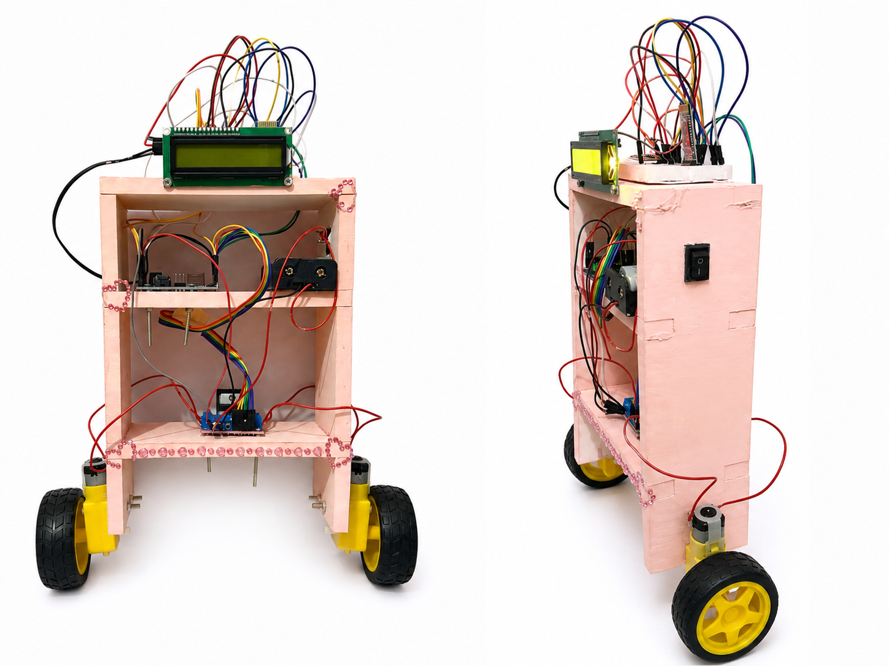
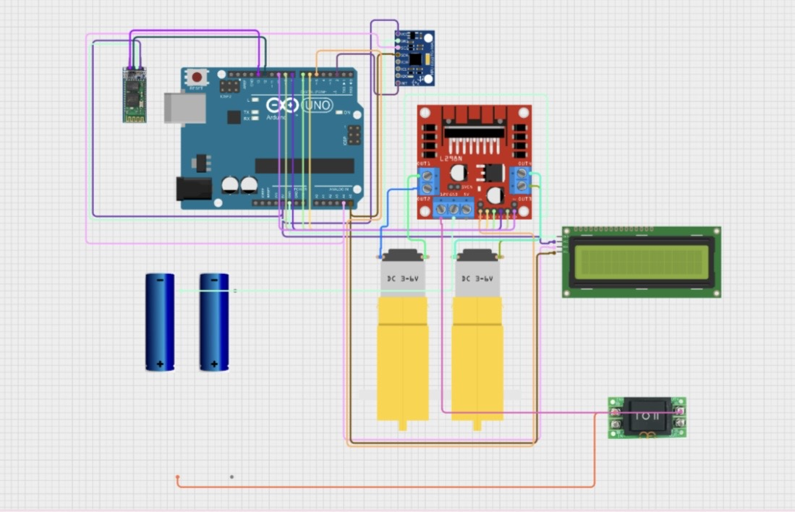

# Arduino Self-Balancing Robot

An Arduino-based two-wheeled self-balancing robot designed to maintain an upright position using real-time orientation data from an **MPU6050 accelerometer and gyroscope** and a **PID control algorithm**.

The Arduino continuously calculates the robot's tilt angle and adjusts the direction and speed of the DC motors through an **L298N motor driver** to compensate for deviations from the desired balance position.

## Features

* Real-time tilt angle measurement using the **MPU6050**
* Self-balancing control using a **PID controller**
* Automatic forward and backward motor correction
* PWM-based motor speed control
* Safety mechanism that stops the motors when the robot exceeds a predefined tilt angle
* Adjustable PID parameters and balance setpoint
* Two-wheel differential drive system

## Hardware

The main components used in the project include:

* Arduino Uno
* MPU6050 accelerometer and gyroscope
* L298N dual H-bridge motor driver
* 2 × DC geared motors
* 2 × wheels
* Robot chassis
* Battery/power supply

## Control System

The robot uses feedback from the MPU6050 to continuously determine its orientation.

The desired balance position is defined by a setpoint. The difference between the measured angle and this setpoint is used as the error input to the PID controller.

The PID controller calculates the required motor correction using three components:

* **Proportional (P)** – responds to the current tilt error
* **Integral (I)** – compensates for accumulated error over time
* **Derivative (D)** – reacts to the rate of change of the error

The PID parameters used in the implemented system are:

* **Kp = 75**
* **Ki = 300**
* **Kd = 2.5**
* **Balance setpoint = 2.9°**

The calculated PID output determines both the direction and PWM speed of the motors, allowing the robot to continuously correct its position and maintain balance.

## Safety Mechanism

A maximum tilt angle is defined in the software. If the robot tilts beyond approximately **30°**, the motors are stopped to prevent uncontrolled movement.

Motor output is also limited to the valid PWM range, with a configured minimum motor speed to overcome the mechanical dead zone of the DC motors.

## Source Code

The complete Arduino source code is available in:

`self_balancing_robot.ino`

## Project Images and Circuit

Photos of the implemented self-balancing robot and the final circuit diagram are included in this repository.

### Robot Prototype

### Circuit Diagram

